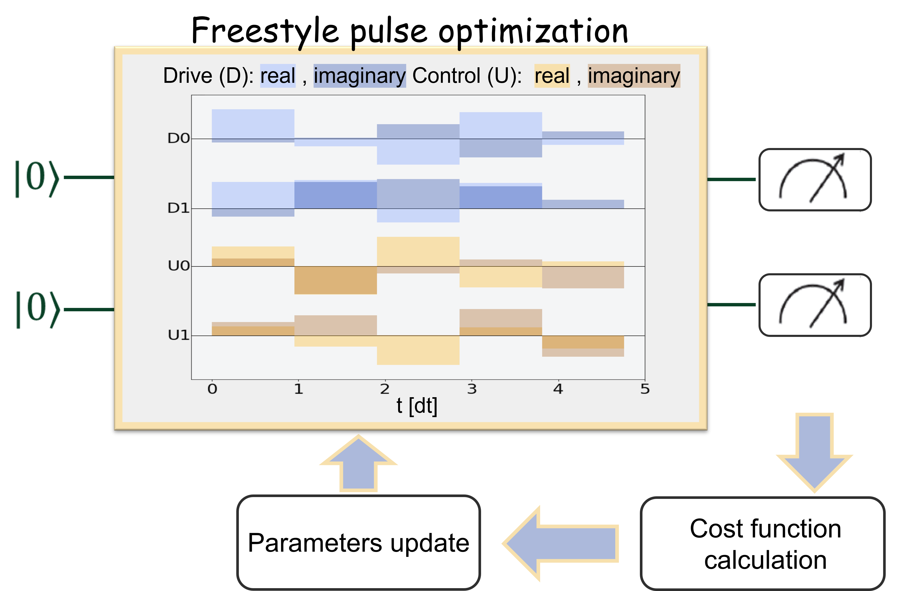

# FreestylePulseOptimization

This project implements VQE algorithm using freestyle pulse optimization.
Currently the modules are set to
 - Simulate Transmon-like systems (IBM in mind) for various qubits using IBM's `qiskit_dynamics`;
 - And, use the IBM's quantum runtime to run the experiments on real devices.
In the future more backends will be added.

The current documentation is sparse, and will grow over time.

In the example directory, we demonstrate using VQE to find the groundstate energy of LiH molecule (for inter-atomic distance of 1.5 Angstrom).

The most useful functions in this repository are:
 1. `FreestylePulseOptimization.simulations.main.optimize_transmon`;
 1. `FreestylePulseOptimization.runtime.main` - This file can accept a JSON file to run experiments.

The documentation for the JSON file can be found in [here](schema_doc.md).
